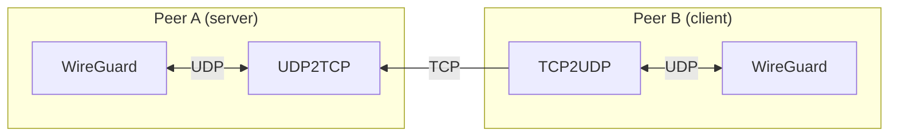

<!--
SPDX-FileCopyrightText: 2023-2025 Arkadiusz Bokowy and contributors
SPDX-License-Identifier: MIT
-->

# WireGuard TCP tunneling

[](https://api.reuse.software/info/github.com/arkq/wg-tcp-tunnel)

## About

This project is a simple UDP-over-TCP tunneling. The main purpose of it is to
allow [WireGuard](https://www.wireguard.com/) to work over TCP.



## Installation

### Dependencies

This project is based on [Boost.Asio](https://www.boost.org/), so in order to
build it you need to have Boost installed. Also, you need to have CMake and a
C++ compiler that supports C++17.

On Debian-based systems all dependencies can be installed by running:

```sh
sudo apt install \
  libboost-dev libboost-log-dev libboost-program-options-dev libssl-dev \
  cmake g++
```

On [Termux](https://termux.dev/), one can get all dependencies by running:

```sh
pkg install \
  boost boost-headers openssl \
  cmake clang
```

### Building

```sh
cmake -S . -B build \
  -DCMAKE_BUILD_TYPE=Release \
  -DENABLE_RUNIT=ON \
  -DWGTT_RUNIT_ARGS="-U 127.0.0.1:51820 --ngrok-dst-tcp-endpoint uri=tcp:.*" \
  -DENABLE_SYSTEMD=ON \
  -DWGTT_SYSTEMD_ARGS="-v -T 0.0.0.0:51820 -u 127.0.0.1:51820" \
  -DENABLE_WEBSOCKET=ON \
  -DENABLE_NGROK=ON
cmake --build build
sudo cmake --install build
```

## Usage

### Server Side

On the server side (the side that has a public IP address) you can run the
`wg-tcp-tunnel` as follows:

```sh
wg-tcp-tunnel --src-tcp=0.0.0.0:51820 --dst-udp=127.0.0.1:51820
```

This will tell the `wg-tcp-tunnel` to listen on all interfaces on port 51820
for TCP connections and forward them to the local WireGuard instance. This
repository contains a [systemd](https://systemd.io/) service file that can be
used to run the `wg-tcp-tunnel` as a service. By default, that service will
do exactly the same as the command above.

### Client Side

On the client side one can run the `wg-tcp-tunnel` as follows:

```sh
wg-tcp-tunnel --src-udp=127.0.0.1:51822 --dst-tcp=<SERVER-IP>:51820
```

This will tell the `wg-tcp-tunnel` to listen on the loopback interface on port
51822 for UDP connections and forward them to the server's public IP address
over TCP. Then in the WireGuard configuration file one needs to specify the
peer's endpoint address as `Endpoint = 127.0.0.1:51822`. Simple as that.

When configured with `-DENABLE_NGROK=ON`, the `wg-tcp-tunnel` also provides
support for getting NGROK endpoint and using it as a destination address. In
order to use this feature, one needs to specify the `--ngrok-api-key=KEY` and
`--ngrok-dst-tcp-endpoint=ENDPOINT` options. For more information about these
options, please refer to the `--help` output.

On Termux, the `wg-tcp-tunnel` can be run as a service using the
[termux-services](https://wiki.termux.com/wiki/Termux-services) package. In
order to automatically install the "wg-tcp-tunnel" service, configure the
project with `-DENABLE_RUNIT=ON`. For `wg-tcp-tunnel` command line arguments
customization use the `-DWGTT_RUNIT_ARGS="..."` option.

### Through an HTTP proxy

When the client side sits behind a corporate HTTP proxy (all outbound TCP
must be tunneled via `CONNECT`), pass `--proxy=HOST:PORT` plus the auth
options. The server side is unchanged — it only ever sees the TCP that the
proxy forwards.

| Option | Purpose |
|---|---|
| `--proxy=HOST:PORT` | The corporate proxy. HOST may be an FQDN or IP. |
| `--proxy-auth=none\|basic\|ntlm\|negotiate` | Auth scheme. `negotiate` prefers Kerberos and falls back to NTLM. `ntlm` and `negotiate` require Windows (SSPI). |
| `--proxy-user=DOMAIN\user` | Username. Optional for `negotiate`/`ntlm` — if omitted, the current Windows logon is used (this is what enables Kerberos SSO). |
| `--proxy-pass=...` | Password. Use `ENV:VAR` to read from an environment variable, e.g. `--proxy-pass=ENV:WG_PROXY_PASS`. |
| `--proxy-spn=HTTP/proxy.fqdn` | Override the Kerberos SPN. Default is `HTTP/<--proxy host>`. |
| `--dst-tcp-host=HOST:PORT` | Use an FQDN as the CONNECT target (rather than `--dst-tcp`'s IP), so the proxy resolves it. Required when the destination host does not have a usable A record from the *client's* DNS but does have one from the proxy's. |

Examples (Windows client):

```cmd
:: Kerberos SSO — uses your current logon, no password to type
wg-tcp-tunnel.exe ^
    --src-udp=127.0.0.1:51822 ^
    --dst-tcp-host=vps.example.com:443 ^
    --proxy=corp-proxy.intra:8080 ^
    --proxy-auth=negotiate

:: NTLM with explicit credentials
set WG_PROXY_PASS=hunter2
wg-tcp-tunnel.exe ^
    --src-udp=127.0.0.1:51822 ^
    --dst-tcp-host=vps.example.com:443 ^
    --proxy=corp-proxy.intra:8080 ^
    --proxy-auth=ntlm ^
    --proxy-user=CORP\jdoe ^
    --proxy-pass=ENV:WG_PROXY_PASS

:: Basic auth (works on any platform)
wg-tcp-tunnel.exe ^
    --src-udp=127.0.0.1:51822 ^
    --dst-tcp=203.0.113.10:80 ^
    --proxy=corp-proxy.intra:3128 ^
    --proxy-auth=basic ^
    --proxy-user=jdoe ^
    --proxy-pass=ENV:WG_PROXY_PASS
```

Notes:

* WireGuard already encrypts and authenticates the inner traffic, so an
  HTTP-only (port 80) endpoint is functionally just as private as one
  fronted by TLS — but TLS-fronted endpoints (port 443) are far more likely
  to traverse strict proxies that whitelist `CONNECT` targets to 443.
* The CONNECT handshake reuses the same TCP socket across all 407
  challenge/response rounds, as required by NTLM and Negotiate. If the
  proxy closes the connection mid-handshake, the auth is not recoverable
  and the client will retry from scratch.
* The `Proxy-Authorization` header is not logged at any verbosity.

## License

This project is licensed under the MIT license. See the [LICENSE](LICENSE) file
for details.
